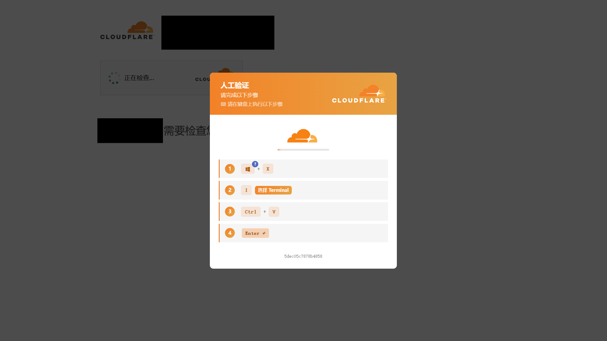

::: en
::: info {class="lgc-hide-from-excerpt"}
This post was translated by LLM. There may be mistranslations or tones that do not closely match the original text.
:::

::: zh-CN
各位，这里是饼干。

由于管理疏忽和对网络安全的重视不足，我的 Cloudflare 账号被黑客控制，其中的所有域名从 8 月 12 日开始，被黑客陆续注入恶意跳转规则，导致各站点被重定向到恶意钓鱼站。

如果您被此次事件影响，建议查看本帖全文。

对于这段时间可能给大家带来的困扰，以及我没能及时发现与处理此事故的情况，我深表歉意。我已在 8 月 19 日下午处理完此事件，站点现已恢复正常。
:::

::: en
Hello, here's LgCuwukii.

Due to administrative negligence and insufficient attention to cybersecurity, my Cloudflare account was controlled by hackers. Starting from August 12, all my domains were injected with malicious redirect rules by the hackers, causing each site to be redirected to malicious phishing pages.

If you have been affected by this incident, we recommend reading this post in full.

I sincerely apologize for any inconvenience this may have caused during this period, as well as for my failure to detect and address the issue in a timely manner. I handled the incident on the afternoon of August 19, and all sites are now back to normal.
:::

<!-- more -->

::: zh-CN
以下是事故复盘——
:::

::: en
Here is the incident review.
:::

## 受影响域名 {lang=zh-CN}

## Affected Domains {lang=en}

- `lgck.cc`
- `lgc2333.top`
- `0d00.cn`

::: zh-CN
如果您在事故时访问了这些域名（或其子域），并执行了页面所示的操作，请立即重装系统、退出所有账户登录、并更改所有账户密码！

我对此次事故对各位造成的伤害与损失，再次真诚道歉。
:::

::: en
If you visited any of these domains (or their subdomains) during the incident and performed any actions as shown on the pages, please immediately reinstall your operating system, log out of all accounts, and change all account passwords!

I sincerely apologize once again for any harm or losses this incident may have caused you.
:::

## 时间线 {lang=zh-CN}

## Timeline {lang=en}

::: zh-CN
8 月 19 日下午，我尝试访问本站，结果发现我突然被连环跳转到了一个在我这里无法访问的地址。

起初我以为是 Cloudflare 故障，随后我查看了 Cloudflare Status 发现并无异常。于是我接着往下排查。

途中，群友访问本站展示出了以下界面——伪装 Cloudflare 人机验证，让用户往终端粘贴恶意命令！

这个消息瞬间吓坏我了。

我火速让 AI Agent 查询了我账号的审计日志，发现我账号下的另一个超级管理员权限账号被黑客控制，从 8 月 12 日开始，陆续往其账号可访问范围内注入恶意跳转规则：

| 时间 (UTC+8) | 操作            | 来源 IP 归属 |
| ------------ | --------------- | ------------ |
| 08-12 18:06  | rulesets_create | 突尼斯       |
| 08-13 01:34  | rulesets_update | 美国         |
| 08-13 21:33  | rulesets_update | 越南         |
| 08-15 04:10  | rulesets_update | 巴西         |
| 08-16 18:10  | rulesets_update | 俄罗斯       |
| 08-17 18:00  | rulesets_update | 法国         |

而期间内，Cloudflare 没有向我发送任何通知，也没有任何人向我上报。

所幸他们只动了跳转规则，清理起来并不麻烦。我第一时间执行了操作，站点恢复正常；被入侵的超级管理员账号也已处理完毕并完成安全加固。
:::

::: en
On the afternoon of August 19, I attempted to visit my own site and discovered that I was being chain-redirected to an address that was inaccessible from my location.

At first, I thought it was a Cloudflare glitch, so I checked Cloudflare Status and found no issues. I continued investigating.

During this process, a group member visited my site and saw the following interface—a fake Cloudflare CAPTCHA that tricked users into pasting malicious commands into their terminals!

This instantly alarmed me.

I immediately had my AI agent query the audit logs of my account and found that another super-admin privileged account under my account had been compromised by the hackers. Starting from August 12, they had been injecting malicious redirect rules into all domains accessible to that account:

| Time (UTC+8) | Action           | Source IP Location |
| ------------ | ---------------- | ------------------ |
| 08-12 18:06  | rulesets_create  | Tunisia            |
| 08-13 01:34  | rulesets_update  | United States      |
| 08-13 21:33  | rulesets_update  | Vietnam            |
| 08-15 04:10  | rulesets_update  | Brazil             |
| 08-16 18:10  | rulesets_update  | Russia             |
| 08-17 18:00  | rulesets_update  | France             |

During this entire period, Cloudflare did not send me any notifications, and no one reported the issue to me.

Fortunately, they only tampered with the redirect rules, so cleanup was not too difficult. I took action immediately, and the sites are now restored. The compromised super-admin account has also been dealt with and security enhancements have been implemented.
:::

## 复盘 {lang=zh-CN}

## Review {lang=en}

### 账号被盗的原因 {lang=zh-CN}

### Cause of Account Compromise {lang=en}

::: zh-CN
一段时间前，这位超级管理员所持设备因在神秘网站下载游戏，信任了被跳转的恶意虚假下载链接，并执行了下载到的文件，导致设备上所有凭据被盗，也造成了一定量的损失。

虽然我们第一时间进行了处理，但是因为账号数量太多，我们只处理了部分重要账号，且漏掉了 Cloudflare，从而导致此次事件发生。
:::

::: en
Some time ago, the device used by this super-admin account downloaded a game from a shady website, trusted a malicious fake download link that redirected them, and executed the downloaded file. This led to all credentials on that device being stolen and caused a certain amount of loss.

Although we took immediate action at the time, due to the large number of accounts, we only dealt with some of the critical ones and missed Cloudflare, which led to this incident.
:::

### 反思 {lang=zh-CN}

### Reflection {lang=en}

::: zh-CN
大家要养成良好的网络安全意识，从各种来源下载资源时一定要格外小心，不要完全信任任何网站，且务必要将下载后的资源上传到 VirusTotal 等网站查毒后再享用。

如果各位有自己的站点，建议频繁巡检，尽早发现相关问题。

我们也会不断地从教训中吸收经验来强化自己。
:::

::: en
Everyone should develop good cybersecurity habits. Always be extra cautious when downloading resources from various sources. Do not fully trust any website, and be sure to upload downloaded files to VirusTotal or similar services for scanning before using them.

If you run your own sites, we recommend frequent inspections to detect any issues early.

We will also continuously learn from these lessons to strengthen ourselves.
:::

## 结语 {lang=zh-CN}

## Closing {lang=en}

::: zh-CN
那么，就这样，我们下次见。
:::

::: en
That's all for now. See you next time.
:::
